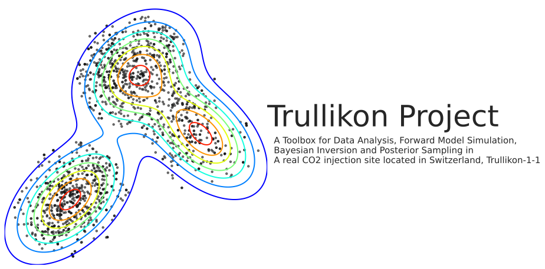
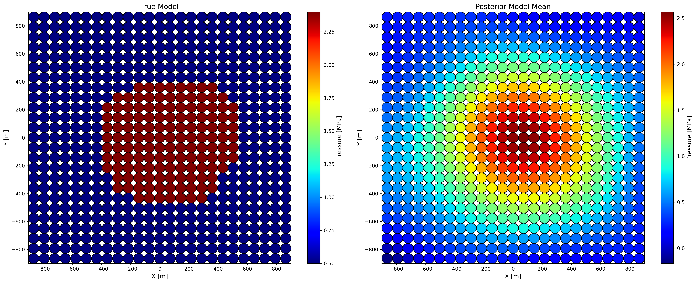
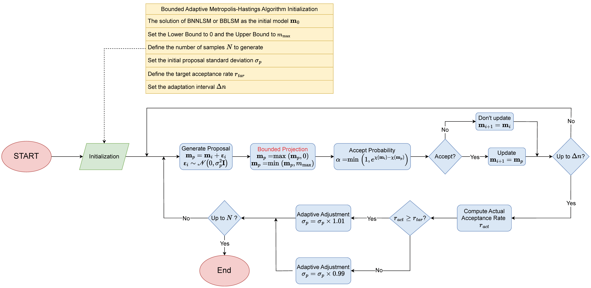

<p align="center">
  
</p>

---

[](https://www.gnu.org/licenses/gpl-3.0) [](https://www.python.org/downloads/release/python-390/) [](https://pypi.org/project/matplotlib/3.8.4/)  [](https://pypi.org/project/numpy/1.26.4/)  [](https://pypi.org/project/pandas/2.1.4/)  [](https://pypi.org/project/scikit-learn/1.2.2/)  [](https://pypi.org/project/scipy/1.14.0/)  [](https://pypi.org/project/seaborn/0.13.2/)

## Step 1: Prior Data Analysis

In Bayesian inversion, the first step is to determine the uncertainty of the observational data, which refers to the standard deviation during a 'peaceful' period when the same instrument continuously observes at the same observation point. Currently, the most precise measurement of surface displacement comes from tilt data, but tiltmeters tend to exhibit 'drift' in their readings. Therefore, the first step is to detrend the data (usually using a linear function as the trend function), then fit the detrended data with a Gaussian function and calculate the mean and standard deviation of this fitted function. The files to implement this step are located in the `Step1_Prior_Data_Analysis` folder, which contains a file named `Tilt_Data_Analysis_1column_Main.py` and two test datasets (.csv). 

## Step 2: Sensitivity Analysis with Uncertainty-adjusted Jacobian Matrix

The Trullikon project uses an analytical forward model (a generalized Geertsma solution) that can simulate any number of layers, with each layer having different model parameters and pressure values. Theoretically, this model can simulate both isotropic and anisotropic models, with different sets of model parameters for each type:
- **Isotropic model**: Shear modulus (or Young's modulus), Poisson's ratio, Biot's coefficient, and Bulk density.
- **Anisotropic model**: Horizontal and Vertical $V_s$, Horizontal and Vertical $V_p$, Biot's coefficient, and Bulk density.

For a specific problem, one can start by using a simple isotropic model to conduct sensitivity analysis of various parameters concerning surface observations, to determine which parameters have a significant impact on the observed data and which have a lesser impact. If the parameters of most layers are not sensitive to the surface observations and only the parameters in some target formation layer are sensitive, it is entirely feasible to use a simple isotropic model without needing to employ an anisotropic model. Moreover, the parameters for each layer are derived from laboratory data of rock samples from the borehole, so the data are in a range (which can also be considered as an uncertainty range). Therefore, the sensitivity analysis tool we use also should account for the uncertainty of each parameter, and hence an **Uncertainty-Adjusted Jacobian Matrix** is used here. The general Jacobian matrix can be defined as follows

```math
\mathbf{J}_{i j}=\left.\frac{\partial d_i}{\partial m_j}\right|_{m_j=m_{j, \text { mid }}}
```

where $m_j=m_{j, \mathrm{mid}}$ is the midpoint of the uncertainty range for the $j$-th model parameter. Then, the uncertainty range $r_j$ for the $j$-th model parameter can be obtained by $`r_j=m_{j, \max }-m_{j, \min}`$. Finally, by combining the uncertainty range $r_j$ with the original Jacobian matrix $`\mathbf{J}_{ij}`$, the Uncertainty-Adjusted Jacobian Matrix $`\mathbf{J}_{i j}^{\prime}`$ can be defined as 

```math
\mathbf{J}_{i j}^{\prime}=\mathbf{J}_{i j} \cdot r_j=\left(\begin{array}{cccc}
J_{11} \cdot r_1 & J_{12} \cdot r_2 & \cdots & J_{1, m} \cdot r_m \\
J_{21} \cdot r_1 & J_{22} \cdot r_2 & \cdots & J_{2, m} \cdot r_m \\
\ \vdots & \vdots & \ddots & \vdots \\
J_{n, 1} \cdot r_1 & J_{n, 2} \cdot r_2 & \cdots & J_{n, m} \cdot r_m
\end{array}\right)
```

Each element in $\mathbf{J}_{i j}^{\prime}$ represents the total sensitivity of the $i$-th observation point to the $j$-th model parameter throughout the entire uncertainty range of the model parameter. In the `Step2_Sensitivity_Analysis` folder, there are two files: `Jacobian_SA_Main.py` is the main function file, where the model and the range of model parameters for sensitivity analysis are defined; `Jacobian_Matrix_Sensitivity_Analysis.py` is the function file, which includes three important functions:

- `compute_jacobian_matrix`: This function is used to calculate the general Jacobian matrix.
- `uncertainty_adjusted_jacobian`: This function converts the general Jacobian matrix into the Uncertainty-Adjusted Jacobian Matrix.
- `plot_jacobian_matrix`: Visualize a Jacobian matrix.

## Step 3: Forward Model

The goal of this project is to invert the pressure changes within the underground target formation at the CO2 injection site using surface observation data. Originally, this problem is a nonlinear inversion problem, but the forward model used in this study allows further development: Use a series of square-cuboid grids to linearize the non-uniform pressure distribution (as shown below)


The main function file for implementing this step is located in the `Step3_Advanced_Forward_Model` folder. This main function will call the following primary functions in the `Forward_Tools` folder:

- `grid_1d_model`: Compute the observational data of a specific model in parallel. 
- `plot_model` and `plot_model_original`: Display the model from horizontal and vertical profiles. 
- `plot_observations`: plot tilt and displacement in one figure 

## Step 4: Bayesian inversion and Posterior Sampling

The original nonlinear problem has been linearized in Step 3, and the necessary prior data information has been obtained in Step 1. The next step is to perform the Bayesian inversion (as shown below) using the forward model and synthetic observational data. Main function files for all the subsequent steps are located in the `Step4_Linear_Inversion` folder. 


### Step 4-1: Generate a true model by a GUI tool

Before conducting numerical experiments, we first need to obtain a true model. To achieve this, we can directly run the `Step1_True_Model_Interactive_Generator_GUI.py` file. This will bring up a GUI interface where we can define the geometry of square-cuboid grids needed (e.g. $25\times 25=625$ grids in $xy$ plane) and assign a pressure change value (Unit [Pa]) to each grid. Once the assignment is complete, simply close the GUI window, and a `model_saved.npy` file will be automatically saved. This file is a vector that records the pressure change value for each grid.

### Step 4-2: Bayesian Least-Squares Method with Posterior Sampling based on Cholesky Decomposition

Given that this is a linear inversion problem, the Bayesian Least-Squares Method (hereinafter referred to as BLSM) can be considered as a first approach for solving it. When the prior data and model both follow a Gaussian distribution, the posterior and misfit function $`\chi({\mathbf{m}})`$ are 

```math
p\left(\mathbf{m} \mid \mathbf{d}^{\text {obs }}\right)=\text { const. } e^{-\frac{1}{2}\left(\mathbf{m}-\mathbf{m}^{\text {prior }}\right)^T \mathbf{C}_M^{-1}\left(\mathbf{m}-\mathbf{m}^{\text {prior }}\right)-\frac{1}{2}\left(\mathbf{G m}-\mathbf{d}^{\text {obs }}\right)^T \mathbf{C}_D^{-1}\left(\mathbf{G m}-\mathbf{d}^{\text {obs }}\right)}
```

```math
\chi(\mathbf{m})=\frac{1}{2}\left(\mathbf{m}-\mathbf{m}^{\text {prior }}\right)^T \mathbf{C}_M^{-1}\left(\mathbf{m}-\mathbf{m}^{\text {prior }}\right)+\frac{1}{2}\left(\mathbf{G m}-\mathbf{d}^{\text {obs }}\right)^T \mathbf{C}_D^{-1}\left(\mathbf{G m}-\mathbf{d}^{\text {obs }}\right)
```

Minimizing the misfit function yields the deterministic posterior mean $`\tilde{\mathbf{m}}`$ and posterior covariance matrix $`\tilde{\mathbf{C}}_M`$:

```math
\tilde{\mathbf{m}}=\mathbf{m}^{\text {prior }}+\mathbf{C}_M \mathbf{G}^T\left(\mathbf{C}_D+\mathbf{G C}_M \mathbf{G}^T\right)^{-1}\left(\mathbf{d}^{\text {obs }}-\mathbf{G m}^{\text {prior }}\right)
```

```math
\tilde{\mathbf{C}}_M=\left(\mathbf{G}^T \mathbf{C}_D^{-1} \mathbf{G}+\mathbf{C}_M^{-1}\right)^{-1}=\mathbf{C}_M-\mathbf{C}_M \mathbf{G}^T\left(\mathbf{C}_D+\mathbf{G} \mathbf{C}_M \mathbf{G}^T\right)^{-1} \mathbf{G} \mathbf{C}_M
```

Although the solution from BLSM is the maximum likelihood point of the posterior distribution, it doesn't mean that the models around it are without value. Therefore, after obtaining $`\tilde{\mathbf{m}}`$ and $`\tilde{\mathbf{C}}_M`$, it is common to sample from the posterior using Cholesky decomposition to obtain more possible model results. First, perform Cholesky decomposition on $`\tilde{\mathbf{C}}_M`$ (this matrix must be symmetric and positive definite): 

```math
\tilde{\mathbf{C}}_M=\mathbf{L L}^{\mathrm{T}}
```

Then, using the lower triangular matrix $`\mathbf{L}`$ and $`\tilde{\mathbf{m}}`$ to randomly generate samples ($`\mathbf{z}`$ is a random deviation vector with a standard normal distribution: mean is 0 and standard deviation is 1). 

```math
\mathbf{y}=\mathbf{L} \mathbf{z}+\tilde{\mathbf{m}}
```

The BLSM solution and posterior sampling based on Cholesky decomposition described above are implemented in `Step2_1_Inversion_BLSM_Tilt_Main.py`. Note that this file only uses the tiltx and tilty data. In a later step, both tilt and InSAR data will be used together for joint data inversion. An example of a true model and posterior model mean $`\tilde{\mathbf{m}}`$ is shown below



### Step 4-3: Bayesian Non-negative Least-Squares Method and Bounded Metropolis-Hastings Posterior Sampling 

In the above figure, it can be observed that the BLSM solution may result in negative values in the edge grids. To avoid negative values in the inversion results, a novel approach can be taken by combining Bayesian inversion with the Non-negative Least-Squares Method (hereinafter referred to as NNLSM) to form the Bayesian Non-negative Least-Squares Method (hereinafter referred to as BNNLSM). The misfit function for NNLSM is:

```math
\min _{\mathbf{x}}\|\mathbf{A x}-\mathbf{b}\|_2^2 \quad \text { subject to } \mathrm{x} \geq 0
```

By first performing Cholesky decomposition on the prior information in the Bayesian inversion and then incorporating it into the NNLSM, we can obtain:

```math
\min _{\mathbf{m}}\left\|\underbrace{\left[\begin{array}{c}
\mathbf{L}_D^{-1} \mathbf{G} \\
\mathbf{L}_M^{-1}
\end{array}\right]}_{\mathbf{A}} \underbrace{[\mathbf{m}]}_{\mathbf{x}}-\underbrace{\left[\begin{array}{c}
\mathbf{L}_D^{-1} \mathbf{d}^{\text {obs }} \\
\mathbf{L}_M^{-1} \mathbf{m}^{\text {prior }}
\end{array}\right]}_{\mathbf{b}}\right\|_2^2 \text { subject to } \mathbf{m} \geq 0
```

where $`\mathbf{C}_D=\mathbf{L}_D \mathbf{L}_D^T`$ and $`\mathbf{C}_M=\mathbf{L}_M \mathbf{L}_M^T`$ ($`\mathbf{C}_D`$ and $`\mathbf{C}_M`$ are prior data and model covariance matrices, they are symmetric and positive definite). The BNNLSM objective function can be directly solved using the `nnls` function from `scipy.optimize`. Note that when using BNNLSM, the inclusion of the non-negative constraint means that the posterior distribution is no longer a simple Gaussian distribution. Therefore, posterior sampling must be performed using the Bounded Adaptive Metropolis-Hastings Algorithm (hereinafter referred to as BAMHA) on the original posterior function. The flowchart is as follows:



BAMHA is a variant of the Metropolis-Hastings Algorithm that incorporates projection and adaptive adjustment. The Metropolis-Hastings Algorithm is a type of MCMC (Markov Chain Monte Carlo) method. Its approach is straightforward and does not require any differentiation, and it has very few hyperparameters that influence the performance of the algorithm. Some posterior samples by BAMHA are shown below


### Step 4-4: Bayesian Bounded Least-Squares Method and Bounded HMC Posterior Sampling 

Combining Bayesian inversion with the Bounded Least-Squares Method results in the Bayesian Bounded Least-Squares Method (hereinafter referred to as BBLSM). The misfit function of the Bounded Least-Squares Method is defined as follows:

```math
\min _{\mathbf{x}}\|\mathbf{A x}-\mathbf{b}\|_2^2 \quad \text { subject to } l \leq \mathrm{x} \leq u
```

This misfit function can be directly solved using the `lsq_linear` function from `scipy.optimize`. By following the same steps as in Step 4-3, the objective function for BBLSM can be obtained. It is identical to that of BNNLSM, except that the constraints are different:

```math
\min _{\mathbf{m}}\left\|\underbrace{\left[\begin{array}{c}
\mathbf{L}_D^{-1} \mathbf{G} \\
\mathbf{L}_M^{-1}
\end{array}\right]}_{\mathbf{A}} \underbrace{[\mathbf{m}]}_{\mathbf{x}}-\underbrace{\left[\begin{array}{c}
\mathbf{L}_D^{-1} \mathbf{d}^{\text {obs }} \\
\mathbf{L}_M^{-1} \mathbf{m}^{\text {prior }}
\end{array}\right]}_{\mathbf{b}}\right\|_2^2 \text { subject to } l \leq \mathbf{m} \leq u
```

At this point, posterior sampling can certainly utilize BAMHA. However, for such linear problems, computing the first and second-order gradients of the misfit function (potential energy) is straightforward. Therefore, one might consider using the Bounded Hamiltonian Monte Carlo (HMC) Algorithm (hereinafter referred to as BHMCA), which offers higher sampling efficiency in high-dimensional model spaces. The flowchart is as follows:


When planning to have 20,000 samples, only about 3,500 samples were accepted using BAMHA, whereas approximately 9,700 samples were accepted using BHMCA. This demonstrates that BHMCA's sampling efficiency is significantly higher than that of MCMC algorithms. Some posterior samples obtained by BHMCA are shown below. It can be observed that the results are smoother, meaning they are closer to the posterior model mean.


Further understanding of [Hamiltonian Monte Carlo](https://en.wikipedia.org/wiki/Hamiltonian_Monte_Carlo):

csc


## References

- [Geophysical Data Analysis: Discrete Inverse Theory. Academic Press, 4th edition](https://www.sciencedirect.com/book/9780128135556/geophysical-data-analysis)
- [Lecture Notes on Inverse Theory](https://doi.org/10.33774/coe-2021-qpq2j)
- [An Analytical Solution for Pressure-Induced Deformation of Anisotropic Multilayered Subsurface](https://www.mdpi.com/2076-3263/11/4/180)
